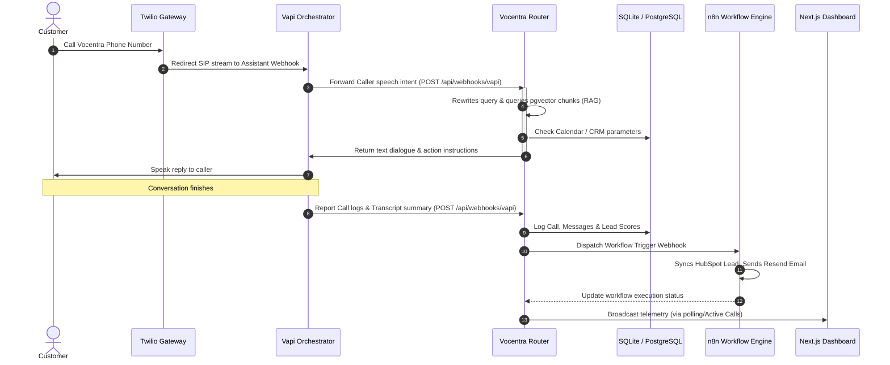
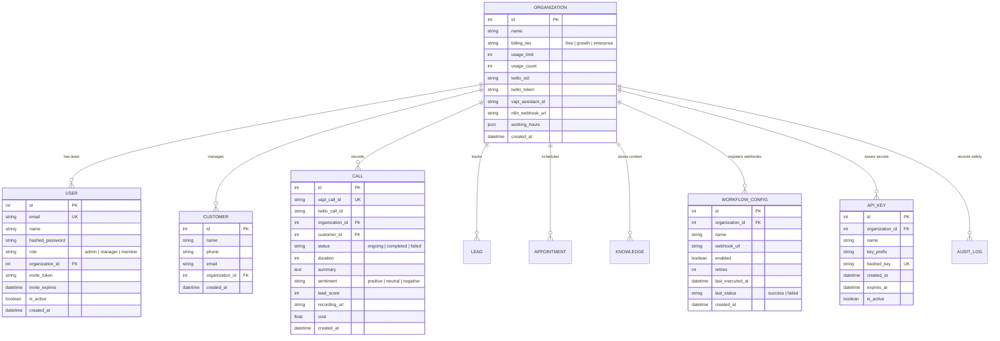

# Vocentra AI - System Architecture

This document describes the high-level system layout, sequence diagrams, and database Entity Relationship Diagram (ERD) mapping.

---

## 1. Sequence Diagram: Inbound Voice Flow

This sequence diagrams details the step-by-step transaction flow from a customer phone call to dynamic tool routing, n8n workflow integrations, and live dashboard telemetry reporting:

---

## 2. Database ERD Mapping

Vocentra AI uses a strict multi-tenant schema model partitioned by `organization_id`. The entity relationship details are mapped below:

