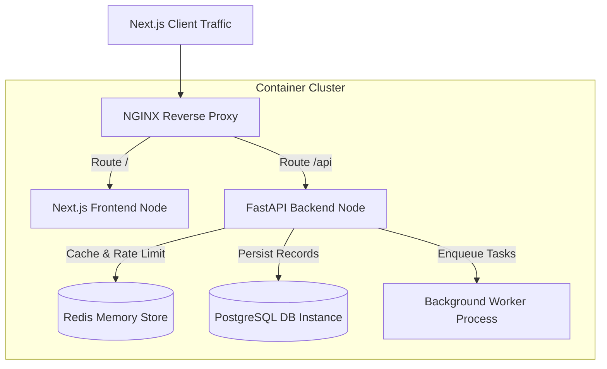

# Vocentra AI - Deployment Topology & Docker Orchestration

This guide outlines running Vocentra AI in a production environment using Docker Compose containers.

---

## 1. Container Topology Mapping

The architecture scales horizontally across dedicated container blocks:



---

## 2. Environment Variables (.env) Reference

Create a `.env` file under the `/backend` folder:

```ini
# Application configuration
PROJECT_NAME="Vocentra AI"
SECRET_KEY="generate-a-secure-secret-key-here"
ACCESS_TOKEN_EXPIRE_MINUTES=60

# Database configurations
DATABASE_URL="sqlite+aiosqlite:///./vocentra.db" # Or postgresql+asyncpg://user:pass@db_host/db_name

# Third-Party Credentials (Multi-tenant defaults)
TWILIO_ACCOUNT_SID=""
TWILIO_AUTH_TOKEN=""
VAPI_ASSISTANT_ID=""
VAPI_API_KEY=""

# Redis Memory Configurations
REDIS_URL="redis://localhost:6379/0"
```

---

## 3. Quickstart Docker Deployment

To launch all containers synchronously:

```bash
# Clone the repository
git clone https://github.com/your-username/vocentra-ai.git
cd vocentra-ai

# Build and scale containers
docker-compose up --build -d
```
