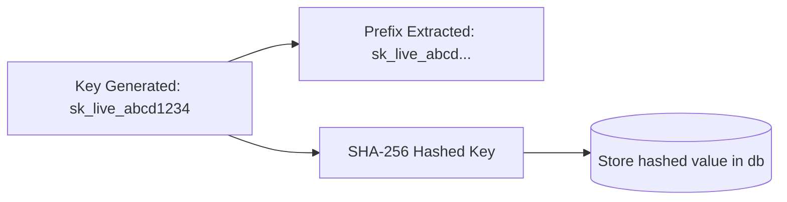

# Vocentra AI - Security Architecture

This document describes the security policies, credentials handling, and access controls implemented across Vocentra AI.

---

## 1. Role-Based Access Control (RBAC) privileges Matrix

Vocentra partitions resources based on user roles (`admin` aka Owner, `manager`, `member` aka Agent):

| Privilege | Member / Agent | Manager | Admin / Owner |
| :--- | :---: | :---: | :---: |
| Read Analytics / Calls | Yes | Yes | Yes |
| Execute Standard Tools | Yes | Yes | Yes |
| Toggles n8n Workflows | No | Yes | Yes |
| Generate Developer API Keys | No | Yes | Yes |
| Revoke Developer API Keys | No | No | Yes |
| Invite New Team Members | No | Yes | Yes |
| Modify Organization settings | No | No | Yes |

---

## 2. Developer API Key Hashing Design

To prevent key leaks, Vocentra stores API tokens securely using hashing protocols:

*   **Prefix Visibility**: Only the key prefix (`sk_live_abcd...`) is displayed in list views.
*   **Cleartext Exposure**: The cleartext key (`sk_live_abcd1234`) is displayed to the user *only once* at creation and is never cached or stored in logs.

---

## 3. Sliding-Window Rate Limiting

The application uses sliding-window rate limiters to prevent API abuse:

*   **Default Limit**: Up to 60 requests per minute per IP address.
*   **IP Logging**: Keeps sliding counters in memory/Redis.
*   **Webhook Whitelisting**: External telephony webhooks (`/api/webhooks/twilio` and `/api/webhooks/vapi`) bypass rate limiting to prevent active call drop failures.
