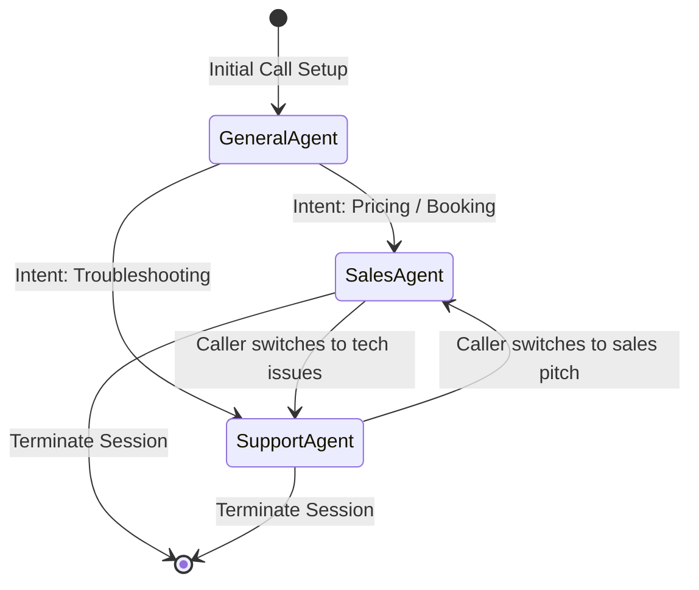
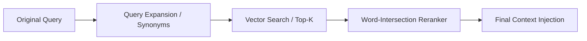

# Vocentra AI - Systems Design

This document details the core systems design implementations inside Vocentra AI.

---

## 1. Multi-Agent Routing Engine

To handle complex inbound calls, Vocentra divides intelligence into specialized agents rather than relying on a single monolithic system prompt.



### Agent Prompts Schema
*   **`GeneralAgent`**: Standard greetings and basic organizational info.
*   **`SalesAgent`**: Targets qualifications (parsing monthly call volumes, budget, timeline parameters). Promotes Growth or Enterprise pricing.
*   **`SupportAgent`**: Focuses on troubleshooting with customer care steps and ticketing triggers.

---

## 2. Dynamic Tool Registry

Vocentra uses the decorator pattern to define tools. The registry automatically parses type hints to build OpenAI function-calling parameters and enforces Role-Based Access Control (RBAC):

```python
@register_tool(
    name="create_crm_lead",
    description="Logs a qualified caller in the organization's CRM.",
    required_role="manager"  # RBAC Security Boundary
)
async def create_crm_lead(customer_id: int, lead_score: int, db: AsyncSession):
    # Tool execution pathway...
```

*   **Metadata Parser**: Extracts function annotations, argument types, and docstrings.
*   **Access Control**: Rejects tool executions dynamically if the agent/user session lacks authorization.

---

## 3. Advanced RAG Retrieval

To prevent vector search hallucinations, Vocentra implements two query pipeline filters:



1.  **Query Expansion**: Extends queries with synonyms (e.g., expanding `"schedule"` to include `"reserve"`, `"appointment"`, `"slot"`) to maximize match probabilities.
2.  **Word-Intersection Reranker**: Calculates match scores based on a hybrid formula:
    $$\text{Score} = 0.7 \times \text{Vector Similarity} + 0.3 \times \text{Word Overlap Ratio}$$
    This ensures exact matches are promoted, neutralizing random vector noise.
